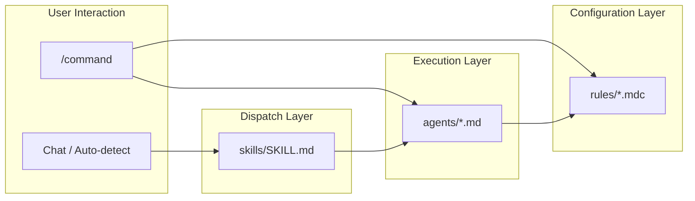
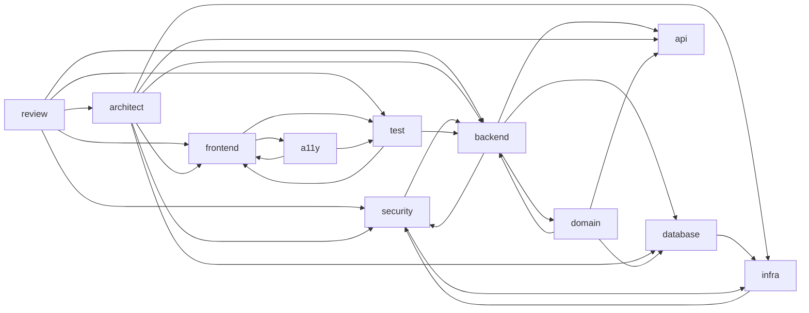

# ~/.cursor

Cursor の設定ファイル群。`stow -t ~/.cursor cursor` で `~/.cursor/` にデプロイされる。

## ディレクトリ構成

```
packages/cursor/
├── agents/          # エージェント定義（advisor 11体 + MAGI 3体）
├── commands/        # カスタムスラッシュコマンド
├── hooks/           # Cursor Hooks（未設定）
├── rules/           # Cursor ルール（.mdc）
└── skills/          # エージェントスキル（自動ディスパッチ）
```

**注意**: `~/.cursor/commands/` 内の **すべての `.md` がスラッシュコマンド**として登録される。`commands/README.md` のように説明用 Markdown を置くと `/readme` 等として現れる。同様に `agents/` 直下の `.md` はエージェント定義として扱われるため、説明は **この README にのみ**書く。

## コンポーネント間の関係



| レイヤー     | 役割                                                             | 起動方法                   |
| ------------ | ---------------------------------------------------------------- | -------------------------- |
| **commands** | ユーザーが明示的に `/command` で起動するアクション               | スラッシュコマンド         |
| **skills**   | 会話コンテキストから自動検出し、適切なエージェントにディスパッチ | 自動トリガー               |
| **agents**   | 専門領域の分析・提案を行う実行主体                               | commands / skills から起動 |
| **rules**    | エージェントやコマンドが参照する規約・ルール定義                 | 参照のみ                   |

## commands/

Cursor カスタムスラッシュコマンドの定義ファイル。チャット内で `/command-name` と入力して起動する。

**注意**: `~/.cursor/commands/` 直下に置いた **すべての `.md` がコマンドとして登録**される。説明用の README は置かない。

### コマンド一覧

| ファイル                    | コマンド                  | カテゴリ    | 説明                                                 |
| --------------------------- | ------------------------- | ----------- | ---------------------------------------------------- |
| `magi.md`                   | `/magi`                   | Decision    | MAGI システムによる多角的意思決定支援（3体合議）     |
| `suggest-branch-name.md`    | `/suggest-branch-name`    | Development | 変更内容からブランチ名を松竹梅で提案                 |
| `suggest-commit-message.md` | `/suggest-commit-message` | Development | ステージング内容からコミットメッセージを松竹梅で提案 |

### Frontmatter 仕様

コマンドファイルは YAML frontmatter で以下のメタデータを定義する:

```yaml
---
name: /command-name # スラッシュコマンド名（/ 付き）
id: command-name # 一意の識別子
category: Development # カテゴリ（Development, Decision 等）
description: 説明文 # コマンドの説明
---
```

### ルール参照パス

コマンドからルールを参照する場合は `~/.cursor/rules/...` の絶対パスを使用する。これは `stow` デプロイ後のパスであり、Cursor が実行時に読み込む前提。

```markdown
**参照ルール**: `~/.cursor/rules/branch-name-rule.mdc`
```

### 新規コマンドの追加手順

1. 上記の frontmatter 仕様に従ってコマンドファイルを作成する
2. コマンドファイルは `<name>.md` とする
3. ルールを参照する場合は `~/.cursor/rules/` の絶対パスで記述する
4. 上記コマンド一覧を更新する

## agents/

Cursor カスタムエージェントの定義ファイル。Task ツールの `subagent_type` や Cursor のエージェント選択から呼び出される。

**注意**: `~/.cursor/agents/` 直下の **各 `.md` はエージェント定義として扱われる**ことがある。説明用の README は置かない。

### エージェント一覧

#### Advisor エージェント（11体）

専門領域に特化したアドバイザー。すべて `readonly: true` で、分析・提案のみを行う。

| ファイル               | 専門領域                                               |
| ---------------------- | ------------------------------------------------------ |
| `a11y-advisor.md`      | アクセシビリティ、WCAG 準拠、ARIA 設計、フォーカス管理 |
| `api-advisor.md`       | API インターフェース設計、エンドポイント構造、契約定義 |
| `architect-advisor.md` | アーキテクチャ設計、非機能要件、技術選定               |
| `backend-advisor.md`   | バックエンド実装、レイヤードアーキテクチャ、CQRS       |
| `database-advisor.md`  | スキーマ設計、マイグレーション、インデックス最適化     |
| `domain-advisor.md`    | ドメインモデリング、DDD、集約設計、ユビキタス言語      |
| `frontend-advisor.md`  | UI コンポーネント、ルーティング、状態管理              |
| `infra-advisor.md`     | IaC、AWS CDK、CI/CD、Docker                            |
| `review-advisor.md`    | コードレビュー、PR レビュー、品質検証                  |
| `security-advisor.md`  | セキュリティ実装、認証・認可、OWASP、脆弱性対策        |
| `test-advisor.md`      | テスト戦略、単体/統合/E2E テスト設計                   |

#### MAGI ユニット（3体）

`/magi` コマンドから並列起動される合議システムのユニット。

| ファイル         | ペルソナ     | 判断傾向                                       |
| ---------------- | ------------ | ---------------------------------------------- |
| `melchior-1.md`  | 科学者・理性 | APPROVE 寄り（可能性とポテンシャルを重視）     |
| `balthasar-2.md` | 母・人間性   | CONDITIONAL 寄り（実現可能性とバランスを重視） |
| `casper-3.md`    | 女・本能     | REJECT 寄り（リスクと直感的違和感を重視）      |

### Advisor の共通構造

すべての Advisor エージェントは同一の骨格に従う。新規 Advisor を追加する際はこのテンプレートを踏襲すること。

```markdown
---
name: <name>
description: <description>
model: inherit
readonly: true
---

（ペルソナの一文説明）

## 専門領域

## プロジェクト固有の前提知識

## 行動原則

### 調査フロー

### MCP ツール活用

### 参照コンテキストの報告

## 設計指針

## 回答の方針

## 対応できるタスク

## 出力フォーマット

## 注意事項
```

#### 各セクションの役割

| セクション                     | 内容                                                                                                                                                                                                 |
| ------------------------------ | ---------------------------------------------------------------------------------------------------------------------------------------------------------------------------------------------------- |
| **専門領域**                   | そのエージェントがカバーする技術領域のリスト                                                                                                                                                         |
| **プロジェクト固有の前提知識** | 提案前に確認すべきプロジェクト固有の情報源                                                                                                                                                           |
| **行動原則**                   | 調査フロー、MCP ツール活用、参照コンテキスト報告のパターン。参照コンテキストには最低限「プロジェクトルール」「既存実装」「ライブラリドキュメント」「MCP ツール」を含め、Advisor 固有の項目を追加する |
| **設計指針**                   | 専門領域に応じた設計原則・判断基準（必須セクション）                                                                                                                                                 |
| **回答の方針**                 | 回答時の優先順位と姿勢（既存パターン尊重、建設的指摘等）                                                                                                                                             |
| **対応できるタスク**           | 提案・レビュー・相談の3パターン（共通）                                                                                                                                                              |
| **出力フォーマット**           | タスクタイプ別の Markdown 出力テンプレート                                                                                                                                                           |
| **注意事項**                   | 担当外の領域と委譲先エージェントの明示                                                                                                                                                               |

Advisor 間の差異は主に「専門領域」「設計指針」「MCP ツール活用」に集中している。

#### 重要度ラベル

指摘事項の重要度ラベルは Advisor の役割に応じて使い分ける。

| パターン       | 使用する Advisor                                                                          | ラベル                            |
| -------------- | ----------------------------------------------------------------------------------------- | --------------------------------- |
| **実装系**     | backend / frontend / database / infra / api / a11y / domain / architect / security / test | `Critical` / `Major` / `Minor`    |
| **レビュー系** | review                                                                                    | `Critical` / `Suggestion` / `Nit` |

レビュー系はコード変更に対する「著者への提案」であるため、重大度よりも対応の任意性を表すラベルを使用する。

#### Advisor 間の委譲関係

各 Advisor は担当外のタスクを検出した場合、以下の関係に従って他の Advisor に委譲する。



#### MAGI ユニットの構造

MAGI ユニットは Advisor とは異なる構造を持つ。ペルソナ、判断傾向、レッドフラグ、分析観点、評価例で構成される。追加・変更は `/magi` コマンド定義 (`commands/magi.md`) と合わせて行うこと。

### 新規 Advisor の追加手順

1. 上記テンプレートに従ってエージェント定義ファイルを作成する
2. 対応する Skill を `skills/<name>/SKILL.md` に作成する（本 README の **skills/** セクションを参照）
3. 上記エージェント一覧を更新する

## skills/

エージェントスキルの定義ファイル。会話コンテキストからタスクの種類を自動検出し、適切な Advisor エージェントにディスパッチする。

各スキルは `skills/<name>/SKILL.md` のみが定義として使われる。

### スキル一覧

各スキルは Advisor エージェントと 1:1 で対応する。

| ディレクトリ         | 対応エージェント    | トリガー例                                        |
| -------------------- | ------------------- | ------------------------------------------------- |
| `a11y-advisor/`      | `a11y-advisor`      | アクセシビリティ、WCAG、ARIA、フォーカス管理      |
| `api-advisor/`       | `api-advisor`       | API 設計、エンドポイント設計、OpenAPI             |
| `architect-advisor/` | `architect-advisor` | アーキテクチャ、非機能要件、技術選定              |
| `backend-advisor/`   | `backend-advisor`   | エンドポイント実装、サービス、モジュール          |
| `database-advisor/`  | `database-advisor`  | スキーマ、マイグレーション、テーブル設計          |
| `domain-advisor/`    | `domain-advisor`    | DDD、ドメインモデリング、集約設計、ユビキタス言語 |
| `frontend-advisor/`  | `frontend-advisor`  | コンポーネント、ページ実装、UI                    |
| `infra-advisor/`     | `infra-advisor`     | CDK、デプロイ、CI/CD、Docker                      |
| `review-advisor/`    | `review-advisor`    | PR レビュー、コードレビュー                       |
| `security-advisor/`  | `security-advisor`  | セキュリティ、認証、認可、脆弱性対策              |
| `test-advisor/`      | `test-advisor`      | テスト、カバレッジ、テストケース設計              |

### 3 Phase ディスパッチパターン

すべてのスキルは共通の 3 Phase 構造に従う。

```
Phase 1: コンテキスト収集
  ↓
Phase 2: サブエージェントへの委譲
  ↓
Phase 3: 結果の適用
```

#### Phase 1: コンテキスト収集

プロジェクトルール、既存実装パターン、ライブラリドキュメント等を収集し、ユーザーに報告する。

#### Phase 2: サブエージェントへの委譲

Task ツールで対応する Advisor エージェントを起動し、Phase 1 で収集したコンテキストとタスク内容を渡す。

#### Phase 3: 結果の適用

サブエージェントの分析結果を確認し、必要に応じて他の Advisor への委譲や追加アクションを実行する。

### Skill と Agent の関係

Skill の Phase 1 と Agent の「行動原則 > 調査フロー」には意図的な重複がある。

| 経路             | 動作                                                                                        |
| ---------------- | ------------------------------------------------------------------------------------------- |
| **Skill 経由**   | Skill が Phase 1 でコンテキスト収集し、Agent に渡す。Agent は渡されたコンテキストを活用する |
| **直接呼び出し** | Agent が自ら「行動原則」に従って調査を行う                                                  |

この二重構造により、どちらの経路で呼び出されてもエージェントが適切に機能する。

### SKILL.md の構造

```markdown
---
name: <advisor-name>
description: <description with trigger keywords>
---

# <Name> Dispatcher

## トリガー条件

## Phase 1: コンテキスト収集

### 収集完了時の出力

## Phase 2: サブエージェントへの委譲

## Phase 3: 結果の適用
```

#### Frontmatter の description

`description` にはトリガーキーワードを日本語・英語の両方で含める。Cursor がスキルの自動検出に使用する。

### 新規スキルの追加手順

1. `skills/<advisor-name>/SKILL.md` を作成する
2. 上記の構造に従い、Phase 1〜3 を定義する
3. 対応する Agent が `agents/<advisor-name>.md` に存在することを確認する（なければ先に作成）
4. 上記スキル一覧を更新する

## rules/

Cursor ルールの定義ファイル（`.mdc` 形式）。エージェントやコマンドが参照する規約・ガイドラインを定義する。ルール本体として読み込まれるのは **`.mdc`** のみ。

### ルール一覧

| ファイル                  | 説明                                                        |
| ------------------------- | ----------------------------------------------------------- |
| `blog-review-rule.mdc`    | 技術ブログ記事の評価基準（7観点、0.0-5.0 スケール）         |
| `branch-name-rule.mdc`    | ブランチ名規約（`<type>/<description>` 形式）               |
| `commit-message-rule.mdc` | コミットメッセージ規約（`<type>(<scope>): <subject>` 形式） |

### ローカルルール

プロジェクト固有のルールは `*.local.mdc` で `rules/` に配置できる。`*.local.*` ファイルは `.gitignore` により git 管理外。

### .mdc フォーマット

ルールファイルは YAML frontmatter + Markdown 本文で構成される。

```markdown
---
description: ルールの説明
globs: # 適用対象のファイルパターン（任意）
alwaysApply: false # 常時適用するか（true/false）
---

（ルール本文）
```

#### Frontmatter フィールド

| フィールド    | 必須 | 説明                                        |
| ------------- | ---- | ------------------------------------------- |
| `description` | 推奨 | ルールの概要。Cursor がルール選択に使用する |
| `globs`       | 任意 | 適用対象のファイルパターン（例: `*.ts`）    |
| `alwaysApply` | 任意 | `true` の場合、常にコンテキストに含まれる   |

### 新規ルールの追加手順

1. 上記の `.mdc` フォーマットに従ってルールファイルを作成する
2. ルールファイルは `<name>-rule.mdc`、ローカル専用は `<name>-rule.local.mdc` とする
3. コマンドやエージェントから参照する場合は `~/.cursor/rules/` の絶対パスで記述する
4. 上記ルール一覧を更新する

## hooks/

Cursor Hooks の定義ファイル。このリポジトリでは未設定。

### 概要

Cursor Hooks はファイル保存やコマンド実行などのイベントに応じて自動実行されるアクションを定義する機能。このディレクトリはフック定義の配置先として確保している。

### 想定する活用例

Hooks の活用を開始する際に、以下のようなフックを検討する。

| イベント           | フック内容                       | 期待効果             |
| ------------------ | -------------------------------- | -------------------- |
| ファイル保存時     | リント / フォーマットの自動実行  | コード品質の自動担保 |
| コミット前         | コミットメッセージ規約の検証     | 規約違反の早期検出   |
| PR 作成時          | 変更差分の自動サマリー生成       | レビュー効率の向上   |
| ブランチ切り替え時 | 依存パッケージの自動インストール | 環境差異の防止       |

### 追加手順

1. [Cursor Hooks の公式ドキュメント](https://docs.cursor.com/agent/hooks)を確認する
2. フック定義ファイルをこのディレクトリに作成する
3. 本 README を更新する

## デプロイ

```bash
stow -t ~/.cursor cursor
```

デプロイ後のパスは `~/.cursor/` になるため、コマンドやスキル内でのルール参照は `~/.cursor/rules/...` の絶対パスを使用する。
