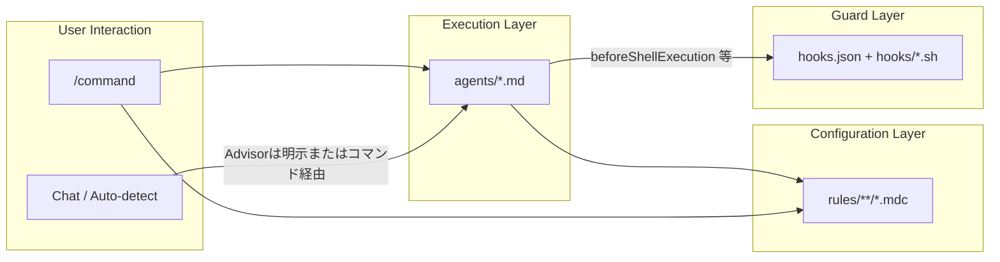
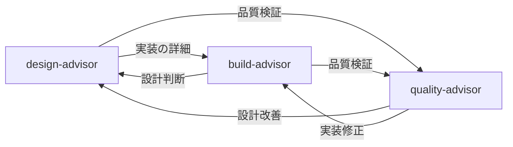

# ~/.cursor

Cursor の設定ファイル群。`make mise-dotfiles`（ルート `mise.toml` の `[dotfiles]`）で `~/.cursor/` にデプロイされる。

共有の rules / commands 本文は `make mise-dotfiles` で `~/.config/shared/ai/` に展開される。`.mdc` やコマンドからは `@~/.config/shared/ai/...` 絶対パスで取り込む（例: `@~/.config/shared/ai/rules/...`、`@~/.config/shared/ai/commands/...`）。

## ディレクトリ構成

```
packages/cursor/
├── agents/          # エージェント定義（advisor 3体 + MAGI 3体）
├── commands/        # カスタムスラッシュコマンド
├── hooks/           # Cursor Hooks スクリプト
├── hooks.json       # Cursor Hooks 定義（グローバル）
├── permissions.json # Command / MCP Allowlist 定義
└── rules/           # Cursor ルール（.mdc）
    ├── advisor/     #   Advisor 共通ルール
    ├── blog/        #   ブログ執筆・公開ルール
    ├── checklists/  #   専門チェックリスト
    ├── conventions/ #   開発規約
    ├── magi/        #   MAGI 合議ルール
    ├── meta/        #   dotfiles AI 設定変更メタ
    └── visual/      #   グラフィックレコード用ルール
```

**注意**: `~/.cursor/commands/` 内の **すべての `.md` がスラッシュコマンド**として登録される。`commands/README.md` のように説明用 Markdown を置くと `/readme` 等として現れる。同様に `agents/` 直下の `.md` はエージェント定義として扱われるため、説明は **この README にのみ**書く。

## コンポーネント間の関係



| レイヤー     | 役割                                                         | 起動方法                                                          |
| ------------ | ------------------------------------------------------------ | ----------------------------------------------------------------- |
| **commands** | ユーザーが明示的に `/command` で起動するアクション           | スラッシュコマンド                                                |
| **agents**   | 専門領域の分析・提案を行う実行主体                           | commands / （Advisor は明示またはコマンド経由）/ 自然言語での指名 |
| **rules**    | エージェントやコマンドが参照する規約・ルール・チェックリスト | 参照のみ                                                          |
| **hooks**    | エージェントの操作を監視・制御・Shell 出力の最適化（RTK）    | イベント駆動（自動実行）                                          |

## commands/

Cursor カスタムスラッシュコマンドの定義ファイル。チャット内で `/command-name` と入力して起動する。

**注意**: `~/.cursor/commands/` 直下に置いた **すべての `.md` がコマンドとして登録**される。説明用の README は置かない。

### コマンド一覧

| ファイル                     | コマンド                   | カテゴリ    | 説明                                                                      |
| ---------------------------- | -------------------------- | ----------- | ------------------------------------------------------------------------- |
| `magi.md`                    | `/magi`                    | Decision    | MAGI システムによる多角的意思決定支援（3体合議）                          |
| `suggest-plan.md`            | `/suggest-plan`            | Development | 要件から計画を松竹梅で提案                                                |
| `suggest-branch-name.md`     | `/suggest-branch-name`     | Development | 変更内容からブランチ名を松竹梅で提案                                      |
| `suggest-commit-message.md`  | `/suggest-commit-message`  | Development | ステージング内容からコミットメッセージを松竹梅で提案                      |
| `apply-coding-rule.md`       | `/apply-coding-rule`       | Development | コーディングルールを読み込んでセッションに適用                            |
| `analyze-issue.md`           | `/analyze-issue`           | Development | チケット URL/ID の課題の原因調査と対応方針の提案                          |
| `suggest-pr-description.md`  | `/suggest-pr-description`  | Development | PR テンプレート準拠の Title / Description を生成・改善                    |
| `suggest-development-log.md` | `/suggest-development-log` | Development | タスク対応の開発ログを MECE 構造で生成                                    |
| `capture-pr-feedback.md`     | `/capture-pr-feedback`     | Quality     | PR URL からフィードバックログへの追記案を生成（読み取り専用）             |
| `verify-output.md`           | `/verify-output`           | Quality     | 直前 AI 応答の再検証と最終版出力（単体・追確認用）                        |
| `review-diff.md`             | `/review-diff`             | Quality     | ステージング済み変更のセルフレビュー（出力前に再検証）                    |
| `review-pr.md`               | `/review-pr`               | Quality     | GitHub PR のレビュー（出力前に再検証・過剰指摘抑制）                      |
| `review-pr-magi.md`          | `/review-pr-magi`          | Quality     | MAGI 3体合議 PR レビュー（出力前に再検証）                                |
| `plan-blog.md`               | `/plan-blog`               | Writing     | テーマと概要からブログ記事の執筆プランを作成                              |
| `review-blog.md`             | `/review-blog`             | Writing     | ブログ記事を 7 観点で評価                                                 |
| `write-graphic-prompt.md`    | `/write-graphic-prompt`    | Visual      | PR・ADR・開発ログから Gemini Nano Banana Pro 向け画像生成プロンプトを出力 |

ラッパーは frontmatter のみ。本文は `@~/.config/shared/ai/commands/<name>.md` で取り込む（[CONVENTIONS.md](../shared/ai/CONVENTIONS.md)）。

**出力再検証**: 手順の正本は `@~/.config/shared/ai/rules/conventions/output-verification-rule.md`。`/verify-output` は直前応答の単体再検証用。`suggest-plan` / `review-diff` 等は最終 Step で同ルールのインライン再検証を参照する（レビュー系は過剰指摘の削減を優先）。

> **ローカルコマンド**: 上記に加え、`*.local.md` で端末専用コマンドを追加できる（Git 管理外）。**Git 管理コマンドと同名にしない**（挙動が不定になりうる）。詳細は「[ローカル拡張](#ローカル拡張)」を参照。

### Frontmatter 仕様

コマンドファイルは YAML frontmatter で以下のメタデータを定義する:

```yaml
---
name: command-name # コマンド識別子（kebab-case）
description: 説明文 # コマンドの説明（パレットに表示）
---
```

> **Note**: コマンド一覧テーブルの「カテゴリ」列は分類表示用であり、frontmatter フィールドとしては定義しない。

### ルール参照パス

- **共有本文（推奨）**: コマンド・ルールの Steps では `@~/.config/shared/ai/rules/<subdir>/<name>.md`（展開後の絶対パス）。リポジトリ編集時は `packages/shared/ai/rules/...` が正本。
- **Cursor ラッパー**: `.mdc` の本文取り込みは `@~/.config/shared/ai/rules/...` と同様。ドキュメント上の例示に `~/.cursor/rules/<subdir>/<name>.mdc` を併記してもよい（展開後の実パス）。

```markdown
**参照ルール**: `@~/.config/shared/ai/rules/conventions/branch-name-rule.md`
```

### 新規コマンドの追加手順

1. 本文を `packages/shared/ai/commands/<name>.md` に追加（frontmatter なし）
2. `packages/cursor/commands/<name>.md` に frontmatter + `@~/.config/shared/ai/commands/<name>.md`
3. Claude 向けに `packages/claude/commands/<name>.md` も同様に追加
4. 上記コマンド一覧を更新する

## agents/

Cursor カスタムエージェントの定義ファイル。起動方法は種別により異なる（Advisor は下記「Advisor エージェント」の説明参照、MAGI は `/magi` から並列起動）。`/name` コマンドや自然言語での指名でも起動されうる。

**注意**: `~/.cursor/agents/` 直下の **各 `.md` はエージェント定義として扱われる**ことがある。説明用の README は置かない。

### エージェント一覧

#### Advisor エージェント（3体）

開発ライフサイクルのフェーズに特化したアドバイザー。すべて `readonly: true`・`model: fast` で、分析・提案のみを行う。ユーザーがサブエージェント利用を明示した場合、またはサブエージェントを使うコマンドから起動された場合にのみ使用される（description match による自動委譲は行わない）。

**モデル（`model`）について**: Advisor 3体および MAGI 3体の frontmatter では `model: fast` を指定している。Cursor 公式の [Subagents](https://cursor.com/docs/subagents) にあるとおり、軽量・高速向けモデルであり、複数サブの並列起動時のレイテンシとコストを抑える意図である。親チャットと同じモデルに揃えたい場合は各 `.md` で `inherit` に、より重い推論が必要ならモデル ID を指定すること。

##### サブエージェントとして Advisor を起動するコマンド

| コマンド                                               | 対象 Advisor                      | 備考                                                                                                          |
| ------------------------------------------------------ | --------------------------------- | ------------------------------------------------------------------------------------------------------------- |
| `/suggest-plan`（サブエージェント明示時）              | `design-advisor`, `build-advisor` | Git 管理。明示がなければ親エージェントが直接分析（[commands/suggest-plan.md](commands/suggest-plan.md) 参照） |
| `/review-diff`, `/review-pr`（サブエージェント明示時） | `quality-advisor`                 | Git 管理。明示がなければ親エージェントが直接分析                                                              |

> `/magi` は MAGI 3体を起動するコマンドであり、Advisor は使用しない。`/review-pr-magi` も MAGI 3体による PR レビューであり、Advisor は使用しない。いずれも詳細は下記の「MAGI ユニット（3体）」セクションを参照。

| ファイル             | フェーズ | 統合元領域                          | 参照チェックリスト                                                                                                      |
| -------------------- | -------- | ----------------------------------- | ----------------------------------------------------------------------------------------------------------------------- |
| `design-advisor.md`  | 設計     | architect + api + domain + database | `checklists/nfr-checklist.mdc`                                                                                          |
| `build-advisor.md`   | 実装     | backend + frontend + infra + a11y   | `checklists/wcag-checklist.mdc`                                                                                         |
| `quality-advisor.md` | 品質     | review + security + test            | `checklists/code-review-checklist.mdc` / `checklists/owasp-top10-checklist.mdc` / `checklists/test-strategy-matrix.mdc` |

##### Advisor 間の委譲関係



#### MAGI ユニット（3体）

`/magi` コマンドから並列起動される合議システムのユニット。

| ファイル         | ペルソナ     | 判断傾向                                       |
| ---------------- | ------------ | ---------------------------------------------- |
| `melchior-1.md`  | 科学者・理性 | APPROVE 寄り（可能性とポテンシャルを重視）     |
| `balthasar-2.md` | 母・人間性   | CONDITIONAL 寄り（実現可能性とバランスを重視） |
| `casper-3.md`    | 女・本能     | REJECT 寄り（リスクと直感的違和感を重視）      |

### Advisor の共通構造

すべての Advisor エージェントは共通行動ルール `advisor/advisor-behavior-rule.mdc` を参照し、同一の骨格に従う。

```markdown
---
name: <name>
description: <description（Advisor は明示的なサブエージェント利用またはコマンド経由でのみ起動する旨を含める）>
model: inherit
readonly: true
---

（ペルソナの一文説明）

## 専門領域

## 行動原則

## 設計原則

## 回答の方針

## 注意事項
```

| セクション     | 内容                                                      |
| -------------- | --------------------------------------------------------- |
| **専門領域**   | 統合された複数ドメインのカバー範囲と参照チェックリスト    |
| **行動原則**   | 共通ルールへの参照 + エージェント固有の調査・分析パターン |
| **設計原則**   | 各ドメインに応じた設計判断基準                            |
| **回答の方針** | 回答時の優先順位と姿勢                                    |
| **注意事項**   | 担当外の領域と委譲先エージェントの明示                    |

#### 重要度ラベル

| パターン       | 使用する Advisor               | ラベル                            |
| -------------- | ------------------------------ | --------------------------------- |
| **実装系**     | design-advisor / build-advisor | `Critical` / `Major` / `Minor`    |
| **レビュー系** | quality-advisor                | `Critical` / `Suggestion` / `Nit` |

#### MAGI ユニットの構造

MAGI ユニットは Advisor とは異なる構造を持つ。ペルソナ、判断傾向、レッドフラグ、分析観点で構成され、出力フォーマット・確信度基準・評価例は共通ルール (`rules/magi/magi-unit-common-rule.mdc`) に定義される。追加・変更は `/magi` コマンド定義 (`commands/magi.md`) および `rules/magi/` 内の共通ルールと合わせて行うこと。

### 新規 Advisor の追加手順

1. 上記テンプレートに従ってエージェント定義ファイルを作成する
2. `advisor/advisor-behavior-rule.mdc` を参照すること
3. description に、明示的なサブエージェント利用またはコマンド経由でのみ起動する旨を含める
4. 専門チェックリストがある場合は `rules/checklists/` に `.mdc` として配置する
5. 上記エージェント一覧を更新する

## rules/

Cursor ルールの定義ファイル（`.mdc` 形式）。エージェントやコマンドが参照する規約・ガイドライン・チェックリストを定義する。ルール本体として読み込まれるのは **`.mdc`** のみ。サブディレクトリに分類されている。

### サブディレクトリ構成

| ディレクトリ   | 内容                     |
| -------------- | ------------------------ |
| `advisor/`     | Advisor 共通行動パターン |
| `blog/`        | ブログ執筆・公開ルール   |
| `checklists/`  | 専門チェックリスト       |
| `conventions/` | 開発規約                 |
| `magi/`        | MAGI 合議ルール          |
| `meta/`        | dotfiles AI 設定変更メタ |
| `visual/`      | グラフィックレコード用   |

### ルール一覧

#### advisor/ -- Advisor 共通

| ファイル                    | 説明                                                                             |
| --------------------------- | -------------------------------------------------------------------------------- |
| `advisor-behavior-rule.mdc` | Advisor エージェント共通の行動パターン（調査フロー、MCP 活用、出力フォーマット） |

#### checklists/ -- 専門チェックリスト

| ファイル                    | 説明                                                     | 参照元          |
| --------------------------- | -------------------------------------------------------- | --------------- |
| `nfr-checklist.mdc`         | 非機能要件チェックリスト（可用性, 性能, セキュリティ等） | design-advisor  |
| `wcag-checklist.mdc`        | WCAG 2.2 AA チェックリスト                               | build-advisor   |
| `code-review-checklist.mdc` | コードレビュー観点チェックリスト                         | quality-advisor |
| `owasp-top10-checklist.mdc` | OWASP Top 10 チェックリスト                              | quality-advisor |
| `test-strategy-matrix.mdc`  | テスト戦略マトリクス                                     | quality-advisor |

#### blog/ -- ブログ執筆・公開

| ファイル                       | 説明                                                |
| ------------------------------ | --------------------------------------------------- |
| `writing-style-rule.mdc`       | 文体・構成・トーンのスタイルガイド                  |
| `structure-templates-rule.mdc` | 記事タイプ別の構成テンプレート集                    |
| `topic-ideation-rule.mdc`      | ネタ発掘の観点と候補評価基準                        |
| `meta-and-seo-rule.mdc`        | タイトル・タグ・要約などメタ情報の決定ガイド        |
| `publish-checklist.mdc`        | 公開前チェックリスト（PASS/FAIL 判定）              |
| `blog-review-rule.mdc`         | 技術ブログ記事の評価基準（7観点、0.0-5.0 スケール） |

#### conventions/ -- 開発規約

| ファイル                      | 説明                                                                          |
| ----------------------------- | ----------------------------------------------------------------------------- |
| `branch-name-rule.mdc`        | ブランチ名規約（`<type>/<description>` 形式）                                 |
| `commit-message-rule.mdc`     | コミットメッセージ規約（`<type>(<scope>): <subject>` 形式）                   |
| `review-common-rule.mdc`      | PR レビュー・diff レビュー共通の調査手順・観点・出力フォーマット              |
| `pr-review-rule.mdc`          | PR レビュー基準・重要度・テンプレート（汎用）                                 |
| `pr-description-rule.mdc`     | PR Title（`type(scope): subject`）・Description の構成・テンプレート          |
| `development-log-rule.mdc`    | 開発ログの MECE 構成・記載ガイド                                              |
| `ticket-retrieval-rule.mdc`   | チケット情報の取得手順（GitHub / その他 URL / ID。プロバイダ固有は `.local`） |
| `codegraph-rule.mdc`          | CodeGraph によるセマンティックコード調査（MCP / CLI）                         |
| `token-optimization-rule.mdc` | 全ワークスペース共通のトークン節約運用（`alwaysApply: true`）                 |

#### meta/ -- dotfiles AI 設定変更

| ファイル                       | 説明                                                        |
| ------------------------------ | ----------------------------------------------------------- |
| `ai-config-rule.mdc`           | AI 設定変更時の 3 ラッパー原則と追加手順                    |
| `wrapper-parity-checklist.mdc` | shared ↔ Cursor ↔ Claude ラッパー同期の PR 前チェックリスト |
| `leakage-checklist.mdc`        | AI 設定 PR 前の公開本文漏洩チェック                         |

#### visual/ -- グラフィックレコード

| ファイル                         | 説明                                                       |
| -------------------------------- | ---------------------------------------------------------- |
| `graphic-record-style-rule.mdc`  | 画像生成向けの構造・レイアウトガイド（画風はプロンプト外） |
| `graphic-record-source-rule.mdc` | PR・ADR・開発ログからの情報抽出・構造化ルール              |

#### magi/ -- MAGI 合議

| ファイル                      | 説明                                                                  |
| ----------------------------- | --------------------------------------------------------------------- |
| `magi-orchestration-rule.mdc` | MAGI 合議オーケストレーション共通ロジック（回答収集・判定・交差分析） |
| `magi-unit-common-rule.mdc`   | MAGI ユニット共通の出力フォーマット・確信度基準・行動規範・評価例     |

### ローカルルール

ローカル専用ルールは `*.local.mdc` として各サブディレクトリに配置する。`*.local.*` ファイルは `.gitignore` により git 管理外。サブディレクトリ内でもパターンがマッチする。

### .mdc フォーマット

ルールファイルは YAML frontmatter + Markdown 本文で構成される。

```markdown
---
description: ルールの説明
globs: # 適用対象のファイルパターン（任意）
alwaysApply: false # 常時適用するか（true/false）
---

（ルール本文）
```

#### Frontmatter フィールド

| フィールド    | 必須 | 説明                                        |
| ------------- | ---- | ------------------------------------------- |
| `description` | 推奨 | ルールの概要。Cursor がルール選択に使用する |
| `globs`       | 任意 | 適用対象のファイルパターン（例: `*.ts`）    |
| `alwaysApply` | 任意 | `true` の場合、常にコンテキストに含まれる   |

### 新規ルールの追加手順

1. 本文（frontmatter なし）を `packages/shared/ai/rules/<subdir>/` に追加する
2. `packages/cursor/rules/<subdir>/<name>.mdc` に frontmatter + `@~/.config/shared/ai/rules/<subdir>/<name>.md`
3. Claude 向けに `packages/claude/rules/<subdir>/<name>.md` も同様に追加する
4. ファイル名は `<name>-rule.mdc`、チェックリストは `<name>-checklist.mdc`、ローカル専用は `<name>.local.mdc` とする
5. コマンドやエージェントから参照する場合は `@~/.config/shared/ai/rules/<subdir>/...` で記述する
6. 上記ルール一覧を更新する

## hooks/ & hooks.json

Cursor Hooks の定義ファイル。エージェントループの各ステージでカスタムスクリプトを実行し、操作の監視・制御・拡張を行う。

### 2層構成

Cursor Hooks は **User hooks**（グローバル）と **Project hooks**（プロジェクト固有）の2層で動作する。両層のフックはすべて実行され、レスポンスが競合した場合は優先度の高い方が勝つ。

```
優先度: Enterprise > Team > Project > User
                            ^^^^^^^^   ^^^^
                            各リポジトリ  この dotfiles
```

| レイヤー               | 配置先                         | スクリプトの起点   | 用途                               |
| ---------------------- | ------------------------------ | ------------------ | ---------------------------------- |
| **User（グローバル）** | `~/.cursor/hooks.json`         | `~/.cursor/`       | プロジェクト共通のガード・監査     |
| **Project**            | `<project>/.cursor/hooks.json` | プロジェクトルート | フォーマッタ、コンテキスト注入など |

### グローバル Hook 一覧

この dotfiles で定義し、`make mise-dotfiles` で `~/.cursor/` にデプロイされるフック。

| イベント               | コマンド / スクリプト  | 説明                                                        |
| ---------------------- | ---------------------- | ----------------------------------------------------------- |
| `beforeShellExecution` | `hooks/guard-shell.sh` | 破壊的 git のブロック、`gh` / `pnpm exec`・`dlx` の確認促進 |
| `preToolUse`           | `rtk hook cursor`      | Shell を `rtk` 経由へ書き換え（matcher: `Shell`）           |

RTK 前提・セットアップ・競合対処: [`packages/shared/ai/docs/RTK.md`](../shared/ai/docs/RTK.md)。`hooks/guard-shell.sh` は共有本体 [`packages/shared/ai/hooks/guard-shell.sh`](../shared/ai/hooks/guard-shell.sh) へ `exec` 委譲する。

#### guard-shell.sh の判定ロジック

`hooks.json` の `matcher: "git |gh |pnpm "` により、コマンド文字列に `git `、`gh `、または `pnpm ` を含む場合にフックが起動する。`failClosed: true` により、スクリプトの異常終了時もコマンドをブロックする（fail-closed）。`jq` が未インストールの場合や入力の解析に失敗した場合もセキュリティ判定が行えないため deny を返す（fail-closed）。フックの役割は **deny と ask**。破壊的コマンドを完全にブロック（deny）し、確認が望ましいコマンドにはユーザー承認を要求（ask）する。それ以外は allow を返し、Allowlist（`permissions.json`）と Cursor が制御する。以下の判定テーブルは git / gh の全サブコマンドを網羅するものではなく、パターンに該当しないコマンドは allow としてフックを通過する点に留意すること。

代表ケースの自動検証: [`packages/shared/ai/hooks/guard-shell.test.sh`](../shared/ai/hooks/guard-shell.test.sh)（`jq` 必須）。

| コマンド                                                                     | 判定  | 理由                                            |
| ---------------------------------------------------------------------------- | ----- | ----------------------------------------------- |
| `git reset --hard`                                                           | deny  | 作業ツリーの不可逆な破棄                        |
| `git clean -f` / `--force`                                                   | deny  | 未追跡ファイルの不可逆な削除                    |
| `git branch -D` / `--delete --force`                                         | deny  | 未マージブランチの強制削除                      |
| `git stash drop` / `stash clear`                                             | deny  | スタッシュの不可逆な削除                        |
| `git reflog delete` / `reflog expire`                                        | deny  | reflog エントリの不可逆な削除                   |
| `git commit`                                                                 | deny  | ユーザーが内容確認してから実行                  |
| `git push`（force 含む）                                                     | deny  | ユーザーが変更確認してから実行                  |
| `git restore`                                                                | deny  | ファイルの復元はユーザーが行うべき操作          |
| `git checkout` / `switch`                                                    | deny  | ブランチ切替はユーザーが実行                    |
| `git fetch` / `pull`                                                         | deny  | リモート操作はユーザーが実行                    |
| `git clone`                                                                  | deny  | `gh repo clone` の使用を案内                    |
| `git config`                                                                 | deny  | 設定の参照・変更はユーザーが行うべき操作        |
| `git rebase`                                                                 | ask   | ユーザーの承認を得てから実行                    |
| `gh pr merge`                                                                | deny  | PR マージの取り消しは困難                       |
| `gh (repo\|release\|issue\|gist\|run) delete`                                | deny  | リソースの不可逆的な削除                        |
| `gh repo archive`                                                            | deny  | リポジトリのアーカイブは取り消しが困難          |
| `gh pr (create\|comment\|edit\|close\|review\|...)`                          | ask   | PR への書き込みはユーザー承認が必要             |
| `gh issue (create\|comment\|edit\|close\|...)`                               | ask   | Issue への書き込みはユーザー承認が必要          |
| `gh release (create\|edit\|upload)`                                          | ask   | Release への書き込みはユーザー承認が必要        |
| `gh repo (create\|edit\|fork\|rename)`                                       | ask   | リポジトリ操作はユーザー承認が必要              |
| `gh gist (create\|edit)`                                                     | ask   | Gist への書き込みはユーザー承認が必要           |
| `gh label (create\|edit\|delete)`                                            | ask   | ラベル変更はユーザー承認が必要                  |
| `gh secret (set\|delete\|remove)`                                            | ask   | シークレット変更はユーザー承認が必要            |
| `gh variable (set\|delete)`                                                  | ask   | 変数変更はユーザー承認が必要                    |
| `gh workflow (run\|enable\|disable)`                                         | ask   | ワークフロー操作はユーザー承認が必要            |
| `gh run (cancel\|rerun)`                                                     | ask   | ワークフロー実行操作はユーザー承認が必要        |
| `gh api` + `-X POST\|PUT\|DELETE\|PATCH` / `-f` `-F` `--field` `--raw-field` | ask   | gh api の書き込みリクエストはユーザー承認が必要 |
| `pnpm exec vitest` / `pnpm exec oxlint`                                      | allow | ローカル lint・テスト。Allowlist と整合         |
| `pnpm exec`（上記以外）/ `pnpm dlx`                                          | ask   | 任意バイナリ実行はユーザー承認が必要            |
| 上記以外（git / gh / pnpm の表にないもの）                                   | allow | フックは通過。Allowlist / Cursor が制御         |

### プロジェクト Hook テンプレート

各リポジトリで `<project>/.cursor/hooks.json` を作成する際のテンプレート。

```json
{
  "version": 1,
  "hooks": {
    "afterFileEdit": [{ "command": ".cursor/hooks/format.sh" }],
    "sessionStart": [{ "command": ".cursor/hooks/session-init.sh" }]
  }
}
```

想定するプロジェクト Hook:

| イベント        | フック内容                         | 期待効果             |
| --------------- | ---------------------------------- | -------------------- |
| `afterFileEdit` | プロジェクト固有のフォーマッタ実行 | コード品質の自動担保 |
| `sessionStart`  | プロジェクト固有コンテキストの注入 | 規約の自動適用       |

### 新規 Hook の追加手順

1. [Cursor Hooks の公式ドキュメント](https://cursor.com/ja/docs/hooks)を確認する
2. グローバル Hook の場合: `hooks.json` にイベント定義を追加し、`hooks/` にスクリプトを作成する
3. プロジェクト Hook の場合: 各リポジトリの `.cursor/hooks.json` に定義する
4. スクリプトに実行権限を付与する（`chmod +x`）
5. 本 README を更新する

## permissions.json

Cursor の Auto-run 時に承認なしで実行を許可するコマンド・MCP ツールの Allowlist 定義。`make mise-dotfiles` で `~/.cursor/permissions.json` にデプロイされると、Cursor Settings の対応する Allowlist は読み取り専用になりこのファイルの内容で上書きされる。

### 設計方針

- **`terminalAllowlist`**: 読み取り系コマンドのみを個別に許可する（Allowlist-first）。git/gh は安全な読み取り系コマンドのみ個別指定し、書き込み・ネットワーク系は Cursor の ask で処理する。プレフィックスマッチ（`pnpm run` → `pnpm run lint`, `pnpm run test` 等にマッチ）。`pnpm exec oxlint` / `pnpm exec vitest` はローカル lint・テスト用に個別許可。それ以外の `pnpm exec`・`pnpm dlx`・`curl`・`npx` など任意コマンド実行やネットワークアクセスが可能なコマンドは除外し、Cursor の ask で制御する
- **`mcpAllowlist`**: 原則は読み取り系パターンのみ許可。書き込み系ツール（`create_*`, `update_*`, `use_*` 等）は含めない。例外として **Playwright MCP**（`~/.cursor/mcp.json` の `Playwright`）は extension モードの E2E 支援のため操作系 `browser_*` を個別許可するが、`browser_run_code_unsafe` / `browser_evaluate` は除外する。`server:tool` 形式、glob パターン対応（`github:get_*` → `get_commit`, `get_file_contents` 等にマッチ）
- **Hooks との関係**: `guard-shell.sh` は Allowlist とは独立した防御層として動作する。Allowlist に含まれないコマンドは Cursor が ask で処理し、Hook は破壊的コマンドの deny（完全ブロック）やカスタムメッセージの提供を担う（Cursor の仕様変更時は再確認が必要）

### terminalAllowlist

| カテゴリ             | エントリ                                                                                                                                                                                    | 備考                                                                                                 |
| -------------------- | ------------------------------------------------------------------------------------------------------------------------------------------------------------------------------------------- | ---------------------------------------------------------------------------------------------------- |
| Unix ユーティリティ  | `awk`, `cat`, `cd`, `comm`, `cp`, `cut`, `diff`, `echo`, `env`, `find`, `grep`, `head`, `kill`, `ls`, `mkdir`, `node`, `paste`, `read`, `sed`, `sort`, `tail`, `timeout`, `uniq`, `wc`      | 個別指定。`curl`（ネットワーク）と `npx`（任意実行）は除外し Cursor の ask で制御                    |
| パッケージマネージャ | `pnpm add`, `pnpm audit`, `pnpm exec oxlint`, `pnpm exec vitest`, `pnpm install`, `pnpm list`, `pnpm ls`, `pnpm outdated`, `pnpm remove`, `pnpm run`, `pnpm store`, `pnpm test`, `pnpm why` | サブコマンド単位で指定。`pnpm exec`（上記以外）/ `pnpm dlx`（任意実行）は除外し Cursor / Hook が制御 |
| VCS (git)            | `git diff`, `git diff-tree`, `git log`, `git rev-parse`, `git show`, `git status`, `git --no-pager diff`, `git --no-pager log`, `git --no-pager show`                                       | 読み取り系のみ個別指定                                                                               |
| GitHub CLI (gh)      | `gh pr checks`, `gh pr diff`, `gh pr list`, `gh pr status`, `gh pr view`, `gh run list`, `gh run view`, `gh search`                                                                         | 読み取り系のみ個別指定                                                                               |
| プロジェクト固有     | `codegraph`, `openspec`                                                                                                                                                                     | `codegraph` はローカル知識グラフ CLI。セットアップは [CODEGRAPH.md](../shared/ai/docs/CODEGRAPH.md)  |

> `kill` はエージェントが起動したバックグラウンドプロセス（dev server 等）の停止に使用する。プロセス停止が Auto-run で実行される点に留意。

### mcpAllowlist

読み取り系パターン（`get_*`, `list_*`, `search_*`, `*_read`）のみ許可。書き込み系ツール（`create_*`, `update_*`, `use_*` 等）は含めない。glob パターンはツール命名規約に依存するため、MCP サーバーの更新時にパターンの妥当性を確認すること。

| サーバー                 | パターン                                                                                  | 備考                                                                                                         |
| ------------------------ | ----------------------------------------------------------------------------------------- | ------------------------------------------------------------------------------------------------------------ |
| `github` / `user-github` | `get_*`, `list_*`, `search_*`, `*_read`, `actions_get`, `actions_list`                    | 読み取り系のみ glob 指定                                                                                     |
| `context7`               | `resolve-library-id`, `get-library-docs`, `query-docs`                                    | 全ツールが読み取り系                                                                                         |
| `codegraph`              | `codegraph_explore`                                                                       | ローカル知識グラフ。セットアップは [CODEGRAPH.md](../shared/ai/docs/CODEGRAPH.md)                            |
| `notion`                 | `notion-fetch`, `notion-search`, `notion-get-comments`                                    | Cursor Plugin Notion MCP（`serverName: notion`）。読み取り系のみ個別指定                                     |
| `storybook`              | `get_story_urls`                                                                          | 個別指定                                                                                                     |
| `chrome_devtools`        | `list_*`                                                                                  | 読み取り系のみ glob 指定                                                                                     |
| `figma`                  | `get_design_context`, `get_screenshot`, `get_figjam`, `get_metadata`                      | 書き込み系（`use_figma` 等）は除外                                                                           |
| `Playwright`             | `browser_snapshot`, `browser_navigate`, `browser_click`, 他 18 件（計 21 ツール個別指定） | `browser_run_code_unsafe`, `browser_evaluate` は除外。接続中タブへのクリック・入力が Auto-run される点に留意 |

### Allowlist の更新手順

1. `permissions.json` を編集する
2. Claude `settings.json` の `permissions.allow` を同期する（[AGENTS.md](../shared/ai/AGENTS.md)）
3. Cursor は変更を自動で再読み込みする（再起動不要）
4. Cursor Settings で Allowlist が読み取り専用になっていることを確認する
5. 本 README を更新する

### CodeGraph MCP（dotfiles 未管理）

`~/.cursor/mcp.json` はシークレットを含むため dotfiles 未管理。CodeGraph 追加は [CODEGRAPH.md](../shared/ai/docs/CODEGRAPH.md) の手動マージ手順に従う。`codegraph install` をそのまま実行しない（mise [dotfiles] 正本とドリフトする）。

**調査フロー**: 構造・フロー・影響範囲の調査優先順位は `token-optimization-rule.mdc`（`alwaysApply`）と `codegraph-rule.mdc`（agent-requestable）に定義。正本は `@~/.config/shared/ai/rules/conventions/token-optimization-rule.md` と `codegraph-rule.md`。

## 自己申告プロトコル

セッション中にどのルール・コマンドが使われたかを把握するための軽量な仕組み。モデルが応答内に `Applied:` を出力することで、利用コンポーネントを可視化する。モデルが指示に従わないリスクがあるため、「観測可能性の向上」であり「監査証跡」ではないと位置づける。

### ルール

本パッケージが提供するルール（`rules/**/*.mdc`）は共有本文 1 行目に以下を記載し、適用時にモデルが**応答の冒頭**に出力する:

```
応答の冒頭に「Applied: <rule-id>」と出力する。
```

`<rule-id>` はファイル名から `.mdc` を除いた文字列（例: `branch-name-rule`, `wcag-checklist`）。`alwaysApply: true` のルール（`token-optimization-rule`）も同一 — 毎応答の冒頭に出力する。

### コマンド

コマンドは Step 0 として応答冒頭に `Applied: /command-name` を出力する。

### Advisor エージェント

`advisor-behavior-rule.mdc` はルールでもあるため、先頭の `Applied:` 出力に加え、「トレース報告」セクションに従い分析結果末尾に使用した agents / rules / tools を記載する。

## ローカル拡張

### Git 管理とローカルファイルの関係

本パッケージ（`packages/cursor/`）が**正本（Source of Truth）**であり、`make mise-dotfiles` で `~/.cursor/` にデプロイされる。ローカル専用のコマンド・ルールは `*.local.md` / `*.local.mdc` の命名規則を使用する。`.gitignore` に `*.local.*` を定義しているため、ローカルファイルは Git 管理外となる。

```
~/.cursor/
├── commands/
│   ├── review-diff.md                  ← Git 管理（ラッパー → shared 本文）
│   ├── review-pr.md                    ← Git 管理
│   └── my-team.local.md                ← ローカル専用（Git コマンドと同名禁止）
├── rules/
│   ├── checklists/
│   │   └── code-review-checklist.mdc   ← Git 管理
│   └── conventions/
│       ├── pr-review-rule.mdc          ← Git 管理（汎用）
│       └── coding-rule.local.mdc       ← ローカル専用（Cursor 専用ルール）
~/.config/shared/ai/rules/conventions/
    ├── pr-review-rule.md               ← Git 管理（汎用本文）
    └── pr-review-rule.local.md         ← ローカル上書き（自社モノレポ向け差分）
```

| 区分     | ファイル名                   | 管理形態                   | 用途                                             |
| -------- | ---------------------------- | -------------------------- | ------------------------------------------------ |
| 正本     | `*.md` / `*.mdc`             | Git 管理 + mise [dotfiles] | 汎用的なコマンド・ルール。チーム共有可能         |
| ローカル | `*.local.md` / `*.local.mdc` | Git 管理外                 | 機密情報を含むもの、端末固有の設定、実験的なもの |

### 共有ルール向けローカル補助ファイル（`review-common-rule`）

[`packages/shared/ai/rules/conventions/review-common-rule.md`](../shared/ai/rules/conventions/review-common-rule.md) は同ディレクトリの **`./pr-review-rule.md`**（必須）と、存在する場合のみ同名の **`.local.md`** を参照する（運用は `shared/ai/README.local.md`、gitignore）。`make mise-dotfiles` で `~/.config/shared/ai/rules/conventions/` に展開する。

`~/.cursor/rules/**/*.local.mdc` は Cursor 専用ルールとして引き続き有効。共有本文から参照される `./*.local.md` は **`shared/rules/` 配下の同じサブディレクトリ**に置く、という点だけ別系統である。

### ローカルコマンド・ルール作成時の規約

- ファイル名は `<name>.local.md` / `<name>.local.mdc` とする
- コマンドは Git 管理のコマンドと同じ frontmatter 仕様・Step 0 トレース（`Applied:`）に従う
- ルールは frontmatter 直後に `このルールを適用したら、「Applied: <rule-id>」と出力する。` を記載する
- 同名コマンドの二重定義（Git 管理 + ローカル）は Cursor の挙動が不定になるため避ける

### レビュー系コマンドの使い分け

| コマンド          | 対象                 | 用途                                 | Advisor                     |
| ----------------- | -------------------- | ------------------------------------ | --------------------------- |
| `/review-diff`    | ステージング済み差分 | PR 作成前のローカルセルフレビュー    | `quality-advisor`（明示時） |
| `/review-pr`      | GitHub PR URL        | リモート PR のレビュー               | `quality-advisor`（明示時） |
| `/review-pr-magi` | GitHub PR URL        | MAGI 3体合議による多角的 PR レビュー | MAGI 3体                    |

`/review-diff` と `/review-pr` はサブエージェント利用を明示した場合に `quality-advisor` を並列起動し、チェックリストベースの体系的レビューを行う。明示がない場合は親エージェントが同じ観点で直接調査する。`/review-pr-magi` は MAGI ペルソナによる多角的評価を重視し、重要度の高い PR やアーキテクチャ変更を伴う PR に適する。

## 既存設定との衝突

`rtk init` 生成物との競合対処: [RTK.md §7](../shared/ai/docs/RTK.md)（`~/.cursor/hooks.json`）。

## デプロイ

```bash
make mise-dotfiles
```

デプロイ後は `~/.cursor/`（ラッパー）と `~/.config/shared/ai/`（共有本文）の両方が有効。コマンド Steps 内のルール参照は `@~/.config/shared/ai/rules/<subdir>/...` を優先する。
