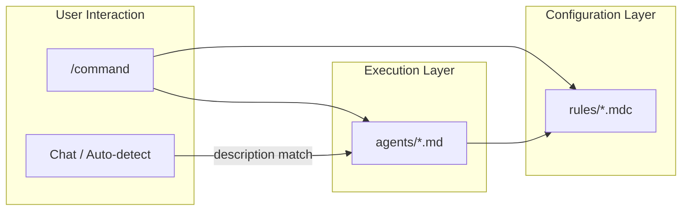
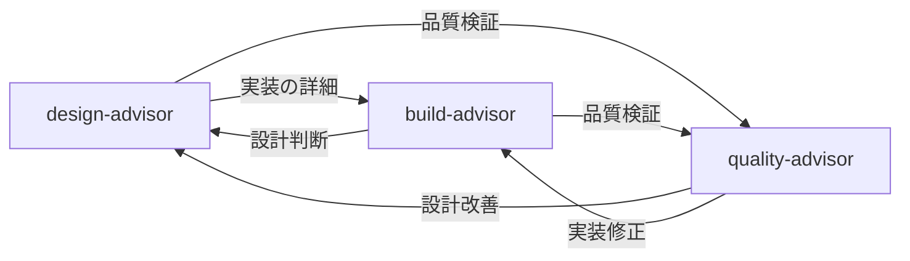

# ~/.cursor

Cursor の設定ファイル群。`stow -t ~/.cursor cursor` で `~/.cursor/` にデプロイされる。

## ディレクトリ構成

```
packages/cursor/
├── agents/          # エージェント定義（advisor 3体 + MAGI 3体）
├── commands/        # カスタムスラッシュコマンド
├── hooks/           # Cursor Hooks（未設定）
└── rules/           # Cursor ルール（.mdc）
```

**注意**: `~/.cursor/commands/` 内の **すべての `.md` がスラッシュコマンド**として登録される。`commands/README.md` のように説明用 Markdown を置くと `/readme` 等として現れる。同様に `agents/` 直下の `.md` はエージェント定義として扱われるため、説明は **この README にのみ**書く。

## コンポーネント間の関係



| レイヤー     | 役割                                                         | 起動方法                                      |
| ------------ | ------------------------------------------------------------ | --------------------------------------------- |
| **commands** | ユーザーが明示的に `/command` で起動するアクション           | スラッシュコマンド                            |
| **agents**   | 専門領域の分析・提案を行う実行主体                           | commands / description match / 自然言語で起動 |
| **rules**    | エージェントやコマンドが参照する規約・ルール・チェックリスト | 参照のみ                                      |

## commands/

Cursor カスタムスラッシュコマンドの定義ファイル。チャット内で `/command-name` と入力して起動する。

**注意**: `~/.cursor/commands/` 直下に置いた **すべての `.md` がコマンドとして登録**される。説明用の README は置かない。

### コマンド一覧

| ファイル                    | コマンド                  | カテゴリ    | 説明                                                 |
| --------------------------- | ------------------------- | ----------- | ---------------------------------------------------- |
| `magi.md`                   | `/magi`                   | Decision    | MAGI システムによる多角的意思決定支援（3体合議）     |
| `suggest-branch-name.md`    | `/suggest-branch-name`    | Development | 変更内容からブランチ名を松竹梅で提案                 |
| `suggest-commit-message.md` | `/suggest-commit-message` | Development | ステージング内容からコミットメッセージを松竹梅で提案 |

### Frontmatter 仕様

コマンドファイルは YAML frontmatter で以下のメタデータを定義する:

```yaml
---
name: /command-name # スラッシュコマンド名（/ 付き）
id: command-name # 一意の識別子
category: Development # カテゴリ（Development, Decision 等）
description: 説明文 # コマンドの説明
---
```

### ルール参照パス

コマンドからルールを参照する場合は `~/.cursor/rules/...` の絶対パスを使用する。これは `stow` デプロイ後のパスであり、Cursor が実行時に読み込む前提。

```markdown
**参照ルール**: `~/.cursor/rules/branch-name-rule.mdc`
```

### 新規コマンドの追加手順

1. 上記の frontmatter 仕様に従ってコマンドファイルを作成する
2. コマンドファイルは `<name>.md` とする
3. ルールを参照する場合は `~/.cursor/rules/` の絶対パスで記述する
4. 上記コマンド一覧を更新する

## agents/

Cursor カスタムエージェントの定義ファイル。会話の description match による自動委譲、`/name` コマンド、または自然言語での指名で起動される。

**注意**: `~/.cursor/agents/` 直下の **各 `.md` はエージェント定義として扱われる**ことがある。説明用の README は置かない。

### エージェント一覧

#### Advisor エージェント（3体）

開発ライフサイクルのフェーズに特化したアドバイザー。すべて `readonly: true`・`model: fast` で、分析・提案のみを行う。

| ファイル             | フェーズ | 統合元領域                          | 参照チェックリスト                                                                     |
| -------------------- | -------- | ----------------------------------- | -------------------------------------------------------------------------------------- |
| `design-advisor.md`  | 設計     | architect + api + domain + database | `nfr-checklist.mdc`                                                                    |
| `build-advisor.md`   | 実装     | backend + frontend + infra + a11y   | `wcag-checklist.mdc`                                                                   |
| `quality-advisor.md` | 品質     | review + security + test            | `code-review-checklist.mdc` / `owasp-top10-checklist.mdc` / `test-strategy-matrix.mdc` |

##### Advisor 間の委譲関係



#### MAGI ユニット（3体）

`/magi` コマンドから並列起動される合議システムのユニット。

| ファイル         | ペルソナ     | 判断傾向                                       |
| ---------------- | ------------ | ---------------------------------------------- |
| `melchior-1.md`  | 科学者・理性 | APPROVE 寄り（可能性とポテンシャルを重視）     |
| `balthasar-2.md` | 母・人間性   | CONDITIONAL 寄り（実現可能性とバランスを重視） |
| `casper-3.md`    | 女・本能     | REJECT 寄り（リスクと直感的違和感を重視）      |

### Advisor の共通構造

すべての Advisor エージェントは共通行動ルール `advisor-behavior-rule.mdc` を参照し、同一の骨格に従う。

```markdown
---
name: <name>
description: <description with keywords for auto-delegation>
model: fast
readonly: true
---

（ペルソナの一文説明）

## 専門領域

## 行動原則

## 設計原則

## 回答の方針

## 注意事項
```

| セクション     | 内容                                                      |
| -------------- | --------------------------------------------------------- |
| **専門領域**   | 統合された複数ドメインのカバー範囲と参照チェックリスト    |
| **行動原則**   | 共通ルールへの参照 + エージェント固有の調査・分析パターン |
| **設計原則**   | 各ドメインに応じた設計判断基準                            |
| **回答の方針** | 回答時の優先順位と姿勢                                    |
| **注意事項**   | 担当外の領域と委譲先エージェントの明示                    |

#### 重要度ラベル

| パターン       | 使用する Advisor               | ラベル                            |
| -------------- | ------------------------------ | --------------------------------- |
| **実装系**     | design-advisor / build-advisor | `Critical` / `Major` / `Minor`    |
| **レビュー系** | quality-advisor                | `Critical` / `Suggestion` / `Nit` |

#### MAGI ユニットの構造

MAGI ユニットは Advisor とは異なる構造を持つ。ペルソナ、判断傾向、レッドフラグ、分析観点、評価例で構成される。追加・変更は `/magi` コマンド定義 (`commands/magi.md`) と合わせて行うこと。

### 新規 Advisor の追加手順

1. 上記テンプレートに従ってエージェント定義ファイルを作成する
2. `advisor-behavior-rule.mdc` を参照すること
3. description にキーワードを含め、自動委譲が機能するようにする
4. 専門チェックリストがある場合は `rules/` に `.mdc` として配置する
5. 上記エージェント一覧を更新する

## rules/

Cursor ルールの定義ファイル（`.mdc` 形式）。エージェントやコマンドが参照する規約・ガイドライン・チェックリストを定義する。ルール本体として読み込まれるのは **`.mdc`** のみ。

### ルール一覧

#### コマンド・開発規約

| ファイル                  | 説明                                                        |
| ------------------------- | ----------------------------------------------------------- |
| `blog-review-rule.mdc`    | 技術ブログ記事の評価基準（7観点、0.0-5.0 スケール）         |
| `branch-name-rule.mdc`    | ブランチ名規約（`<type>/<description>` 形式）               |
| `commit-message-rule.mdc` | コミットメッセージ規約（`<type>(<scope>): <subject>` 形式） |

#### Advisor 共通

| ファイル                    | 説明                                                                             |
| --------------------------- | -------------------------------------------------------------------------------- |
| `advisor-behavior-rule.mdc` | Advisor エージェント共通の行動パターン（調査フロー、MCP 活用、出力フォーマット） |

#### 専門チェックリスト

| ファイル                    | 説明                                                     | 参照元          |
| --------------------------- | -------------------------------------------------------- | --------------- |
| `nfr-checklist.mdc`         | 非機能要件チェックリスト（可用性, 性能, セキュリティ等） | design-advisor  |
| `wcag-checklist.mdc`        | WCAG 2.2 AA チェックリスト                               | build-advisor   |
| `code-review-checklist.mdc` | コードレビュー観点チェックリスト                         | quality-advisor |
| `owasp-top10-checklist.mdc` | OWASP Top 10 チェックリスト                              | quality-advisor |
| `test-strategy-matrix.mdc`  | テスト戦略マトリクス                                     | quality-advisor |

### ローカルルール

プロジェクト固有のルールは `*.local.mdc` で `rules/` に配置できる。`*.local.*` ファイルは `.gitignore` により git 管理外。

### .mdc フォーマット

ルールファイルは YAML frontmatter + Markdown 本文で構成される。

```markdown
---
description: ルールの説明
globs: # 適用対象のファイルパターン（任意）
alwaysApply: false # 常時適用するか（true/false）
---

（ルール本文）
```

#### Frontmatter フィールド

| フィールド    | 必須 | 説明                                        |
| ------------- | ---- | ------------------------------------------- |
| `description` | 推奨 | ルールの概要。Cursor がルール選択に使用する |
| `globs`       | 任意 | 適用対象のファイルパターン（例: `*.ts`）    |
| `alwaysApply` | 任意 | `true` の場合、常にコンテキストに含まれる   |

### 新規ルールの追加手順

1. 上記の `.mdc` フォーマットに従ってルールファイルを作成する
2. ルールファイルは `<name>-rule.mdc` またはチェックリストは `<name>-checklist.mdc`、ローカル専用は `<name>.local.mdc` とする
3. コマンドやエージェントから参照する場合は `~/.cursor/rules/` の絶対パスで記述する
4. 上記ルール一覧を更新する

## hooks/

Cursor Hooks の定義ファイル。このリポジトリでは未設定。

### 概要

Cursor Hooks はファイル保存やコマンド実行などのイベントに応じて自動実行されるアクションを定義する機能。このディレクトリはフック定義の配置先として確保している。

### 想定する活用例

Hooks の活用を開始する際に、以下のようなフックを検討する。

| イベント           | フック内容                       | 期待効果             |
| ------------------ | -------------------------------- | -------------------- |
| ファイル保存時     | リント / フォーマットの自動実行  | コード品質の自動担保 |
| コミット前         | コミットメッセージ規約の検証     | 規約違反の早期検出   |
| PR 作成時          | 変更差分の自動サマリー生成       | レビュー効率の向上   |
| ブランチ切り替え時 | 依存パッケージの自動インストール | 環境差異の防止       |

### 追加手順

1. [Cursor Hooks の公式ドキュメント](https://docs.cursor.com/agent/hooks)を確認する
2. フック定義ファイルをこのディレクトリに作成する
3. 本 README を更新する

## デプロイ

```bash
stow -t ~/.cursor cursor
```

デプロイ後のパスは `~/.cursor/` になるため、コマンドやエージェント内でのルール参照は `~/.cursor/rules/...` の絶対パスを使用する。
