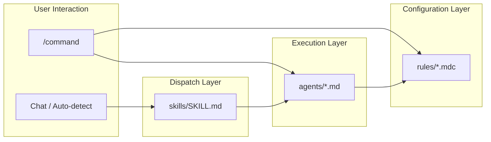

# ~/.cursor

Cursor の設定ファイル群。`stow -t ~/.cursor cursor` で `~/.cursor/` にデプロイされる。

## ディレクトリ構成

```
packages/cursor/
├── agents/          # エージェント定義（advisor 11体 + MAGI 3体）
├── commands/        # カスタムスラッシュコマンド
├── hooks/           # Cursor Hooks（未設定）
├── rules/           # Cursor ルール（.mdc）
└── skills/          # エージェントスキル（自動ディスパッチ）
```

各ディレクトリの詳細は、それぞれの README.md を参照。

## コンポーネント間の関係



| レイヤー     | 役割                                                             | 起動方法                   |
| ------------ | ---------------------------------------------------------------- | -------------------------- |
| **commands** | ユーザーが明示的に `/command` で起動するアクション               | スラッシュコマンド         |
| **skills**   | 会話コンテキストから自動検出し、適切なエージェントにディスパッチ | 自動トリガー               |
| **agents**   | 専門領域の分析・提案を行う実行主体                               | commands / skills から起動 |
| **rules**    | エージェントやコマンドが参照する規約・ルール定義                 | 参照のみ                   |

## デプロイ

```bash
stow -t ~/.cursor cursor
```

デプロイ後のパスは `~/.cursor/` になるため、コマンドやスキル内でのルール参照は `~/.cursor/rules/...` の絶対パスを使用する。

## ローカル設定の規約

環境固有・プロジェクト固有の設定は `*.local.*` サフィックスを付けて管理する。

- `*.local.*` ファイルは `.gitignore` により git 管理外
- 共通ファイルと同じディレクトリに配置する（サブディレクトリ不要）
- ファイルが存在しない環境でもエラーにならない

### 例

```
rules/
├── commit-message-rule.mdc          # 共通（git 管理）
├── coding-rule.local.mdc            # ローカル（git 管理外）
└── pr-review-rule.local.mdc         # ローカル（git 管理外）

commands/
├── magi.md                           # 共通（git 管理）
└── pr-review.local.md                # ローカル（git 管理外）
```
