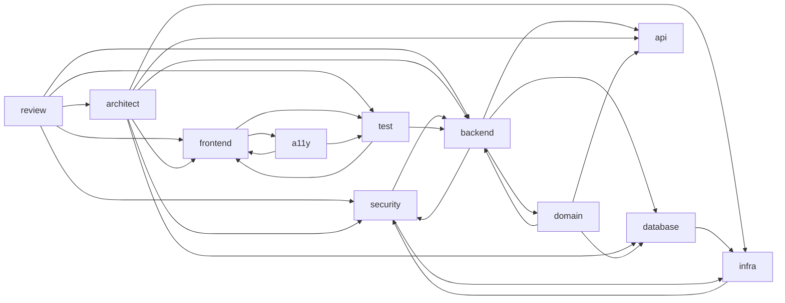

# agents/

Cursor カスタムエージェントの定義ファイル。Task ツールの `subagent_type` や Cursor のエージェント選択から呼び出される。

## エージェント一覧

### Advisor エージェント（11体）

専門領域に特化したアドバイザー。すべて `readonly: true` で、分析・提案のみを行う。

| ファイル               | 専門領域                                               |
| ---------------------- | ------------------------------------------------------ |
| `a11y-advisor.md`      | アクセシビリティ、WCAG 準拠、ARIA 設計、フォーカス管理 |
| `api-advisor.md`       | API インターフェース設計、エンドポイント構造、契約定義 |
| `architect-advisor.md` | アーキテクチャ設計、非機能要件、技術選定               |
| `backend-advisor.md`   | バックエンド実装、レイヤードアーキテクチャ、CQRS       |
| `database-advisor.md`  | スキーマ設計、マイグレーション、インデックス最適化     |
| `domain-advisor.md`    | ドメインモデリング、DDD、集約設計、ユビキタス言語      |
| `frontend-advisor.md`  | UI コンポーネント、ルーティング、状態管理              |
| `infra-advisor.md`     | IaC、AWS CDK、CI/CD、Docker                            |
| `review-advisor.md`    | コードレビュー、PR レビュー、品質検証                  |
| `security-advisor.md`  | セキュリティ実装、認証・認可、OWASP、脆弱性対策        |
| `test-advisor.md`      | テスト戦略、単体/統合/E2E テスト設計                   |

### MAGI ユニット（3体）

`/magi` コマンドから並列起動される合議システムのユニット。

| ファイル         | ペルソナ     | 判断傾向                                       |
| ---------------- | ------------ | ---------------------------------------------- |
| `melchior-1.md`  | 科学者・理性 | APPROVE 寄り（可能性とポテンシャルを重視）     |
| `balthasar-2.md` | 母・人間性   | CONDITIONAL 寄り（実現可能性とバランスを重視） |
| `casper-3.md`    | 女・本能     | REJECT 寄り（リスクと直感的違和感を重視）      |

## Advisor の共通構造

すべての Advisor エージェントは同一の骨格に従う。新規 Advisor を追加する際はこのテンプレートを踏襲すること。

```markdown
---
name: <name>
description: <description>
model: inherit
readonly: true
---

（ペルソナの一文説明）

## 専門領域

## プロジェクト固有の前提知識

## 行動原則

### 調査フロー

### MCP ツール活用

### 参照コンテキストの報告

## 設計指針

## 回答の方針

## 対応できるタスク

## 出力フォーマット

## 注意事項
```

### 各セクションの役割

| セクション                     | 内容                                                                                                                                                                                                 |
| ------------------------------ | ---------------------------------------------------------------------------------------------------------------------------------------------------------------------------------------------------- |
| **専門領域**                   | そのエージェントがカバーする技術領域のリスト                                                                                                                                                         |
| **プロジェクト固有の前提知識** | 提案前に確認すべきプロジェクト固有の情報源                                                                                                                                                           |
| **行動原則**                   | 調査フロー、MCP ツール活用、参照コンテキスト報告のパターン。参照コンテキストには最低限「プロジェクトルール」「既存実装」「ライブラリドキュメント」「MCP ツール」を含め、Advisor 固有の項目を追加する |
| **設計指針**                   | 専門領域に応じた設計原則・判断基準（必須セクション）                                                                                                                                                 |
| **回答の方針**                 | 回答時の優先順位と姿勢（既存パターン尊重、建設的指摘等）                                                                                                                                             |
| **対応できるタスク**           | 提案・レビュー・相談の3パターン（共通）                                                                                                                                                              |
| **出力フォーマット**           | タスクタイプ別の Markdown 出力テンプレート                                                                                                                                                           |
| **注意事項**                   | 担当外の領域と委譲先エージェントの明示                                                                                                                                                               |

Advisor 間の差異は主に「専門領域」「設計指針」「MCP ツール活用」に集中している。

### 重要度ラベル

指摘事項の重要度ラベルは Advisor の役割に応じて使い分ける。

| パターン       | 使用する Advisor                                                                          | ラベル                            |
| -------------- | ----------------------------------------------------------------------------------------- | --------------------------------- |
| **実装系**     | backend / frontend / database / infra / api / a11y / domain / architect / security / test | `Critical` / `Major` / `Minor`    |
| **レビュー系** | review                                                                                    | `Critical` / `Suggestion` / `Nit` |

レビュー系はコード変更に対する「著者への提案」であるため、重大度よりも対応の任意性を表すラベルを使用する。

### Advisor 間の委譲関係

各 Advisor は担当外のタスクを検出した場合、以下の関係に従って他の Advisor に委譲する。



### MAGI ユニットの構造

MAGI ユニットは Advisor とは異なる構造を持つ。ペルソナ、判断傾向、レッドフラグ、分析観点、評価例で構成される。追加・変更は `/magi` コマンド定義 (`commands/magi.md`) と合わせて行うこと。

## 新規 Advisor の追加手順

1. 上記テンプレートに従ってエージェント定義ファイルを作成する
2. 対応する Skill を `skills/<name>/SKILL.md` に作成する（`skills/README.md` 参照）
3. この README のエージェント一覧を更新する
