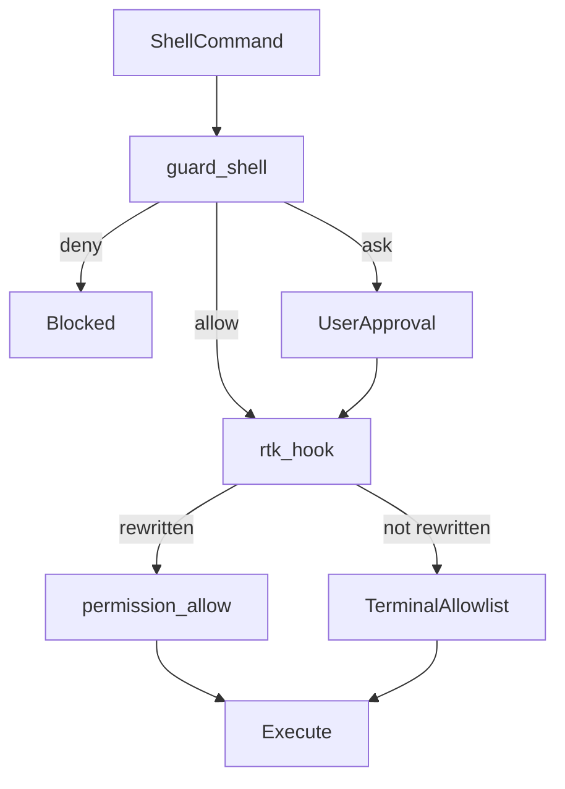

# RTK（Rust Token Killer）

Shell 出力のトークン削減用 CLI プロキシ。本 dotfiles の AI 設定（Cursor / Claude Code）は **RTK インストール済み・hook 有効** を前提とする。

- 公式: [rtk-ai/rtk](https://github.com/rtk-ai/rtk)
- エージェント運用ルール: `@~/.config/shared/ai/rules/conventions/token-optimization-rule.md`（Cursor `alwaysApply`、Claude は `CLAUDE.md` から import）

## 1. 前提条件・セットアップ順

```bash
make mise           # bootstrap: packages / dotfiles / tools / task（rtk / jq 含む）
rtk --version && rtk gain   # smoke test（下記 §3）
```

| 依存                      | 用途                                                                        |
| ------------------------- | --------------------------------------------------------------------------- |
| `rtk`（PATH / mise shim） | hook 書き換え・出力圧縮（対話シェルは PATH、hook は shim 絶対パス）         |
| `jq`（mise shim）         | guard-shell 判定（`$HOME/.local/share/mise/shims/jq`）                      |
| `make mise` 済み          | shared / rtk / cursor / claude / `~/.config/mise` の展開 + CLI インストール |

## 2. アーキテクチャ

Shell 実行は **guard → RTK → allowlist** の 3 層で制御する。hook 順序は **guard → RTK**（変更しない）。



| レイヤ        | 正本                                                                | 役割                                                                            |
| ------------- | ------------------------------------------------------------------- | ------------------------------------------------------------------------------- |
| **guard**     | `packages/shared/ai/hooks/guard-shell.sh`                           | git / gh / pnpm の deny・ask。`rtk ` プレフィックスを strip して分類            |
| **RTK**       | `packages/claude/settings.json`, `packages/cursor/hooks.json`       | コマンドを `rtk` 経由へ書き換え。Claude `permissions.deny` 対象は書き換えしない |
| **allowlist** | `packages/cursor/permissions.json`, `packages/claude/settings.json` | Auto-run 許可（読み取り専用 terminal / MCP）                                    |

**allowlist 拡張禁止**: RTK が書き換えるコマンド（例: `git status` → `rtk git status`）は allowlist に追加しない。RTK hook が書き換え成功時に `permission: allow` を直接返し、allowlist をバイパスする。allowlist は**元のコマンド形式**にのみ適用される。

Allowlist 同期手順: [AGENTS.md](../AGENTS.md)。検証: `scripts/check-allowlist-sync.sh`, `check-deny-guard-sync.sh`。

## 3. インストール確認（smoke test）

```bash
rtk --version         # rtk X.Y.Z
rtk gain              # 統計が表示される（"command not found" でないこと）
which rtk             # mise shim / installs 経由であること（例: ~/.local/share/mise/...）
```

**名前衝突**: `rtk gain` が失敗する場合、[reachingforthejack/rtk](https://github.com/reachingforthejack/rtk)（Rust Type Kit）が PATH に入っている可能性がある。`which -a rtk` と `rtk --version` で mise 由来（aqua:rtk-ai/rtk）であることを確認する。

## 4. Hook 動作

エージェントが Shell を実行すると、guard の**後**に RTK hook が自動でコマンドを書き換える。

- 例: `git status` → `rtk git status`（エージェントからは透過的）
- guard は `rtk ` プレフィックスを strip して分類する（`rtk git push` でも deny が効く）
- Claude: RTK は `permissions.deny` を読み、deny 対象コマンドの書き換えをスキップする

Meta コマンド（`rtk gain` 等）は hook を経由せず、エージェントが **`rtk` を直接** 実行する。

## 5. Meta コマンド

```bash
rtk gain              # トークン節約の統計
rtk gain --history    # コマンド別の節約履歴
rtk discover --all    # 漏れている節約機会の洗い出し
rtk discover --all --since 7
rtk proxy <cmd>       # フィルタなしで生コマンド実行（デバッグ用）
```

`discover` は計測時 **必ず `--all`** を付ける。デフォルトは現プロジェクト（CWD）のみ。

## 6. 設定

| 項目               | 正本                            | デプロイ先                  |
| ------------------ | ------------------------------- | --------------------------- |
| RTK グローバル設定 | `packages/rtk/config.toml`      | `~/.config/rtk/config.toml` |
| hook（Claude）     | `packages/claude/settings.json` | `~/.claude/settings.json`   |
| hook（Cursor）     | `packages/cursor/hooks.json`    | `~/.cursor/hooks.json`      |

`[limits]`（`grep_max_results` 等）で grep 出力・passthrough 閾値を調整する。`gh pr diff` や `grep` を `exclude_commands` に追加しない（トークン節約が無効化される）。

`[hooks] exclude_commands` には対話的 git（`git rebase` 等）を登録し、TTY 挙動を保つ。

## 7. dotfiles 運用

- 設定 JSON の正本は本リポジトリ（`make mise` で dotfiles 展開）
- **`rtk init -g` をそのまま流さない** — `settings.json` / `hooks.json` を直接パッチし mise [dotfiles] と競合する
- 初回確認・ドキュメント参照のみ: `rtk init -g --no-patch`（Cursor は `--agent cursor` 付き可）
- **`rtk init -g --agent cursor` をそのまま流さない** — `~/.cursor/hooks.json` が通常ファイルとして生成され競合する
- RTK アップデート後: `rtk init --show` で hook 状態を確認し、本ファイルの文言が変わる場合のみ手動同期

### 競合の対処

| ツール | 衝突ファイル                                  | 対処                                                          |
| ------ | --------------------------------------------- | ------------------------------------------------------------- |
| Claude | `~/.claude/settings.json`, `~/.claude/RTK.md` | repo と `diff` し、同一ならバックアップして削除 → `make mise` |
| Cursor | `~/.cursor/hooks.json`                        | 同上                                                          |

```bash
# Claude の例
diff ~/.claude/settings.json packages/claude/settings.json
mv -f ~/.claude/settings.json ~/.claude/settings.json.bak
make mise

# Cursor の例
diff ~/.cursor/hooks.json packages/cursor/hooks.json
mv -f ~/.cursor/hooks.json ~/.cursor/hooks.json.bak
make mise
```

## 8. ツール別 hook 配線

| 項目             | Claude Code                                                             | Cursor                                                      |
| ---------------- | ----------------------------------------------------------------------- | ----------------------------------------------------------- |
| guard イベント   | `PreToolUse`（matcher: `Bash`）                                         | `beforeShellExecution`（matcher: `git \|gh \|pnpm `）       |
| guard コマンド   | `$HOME/.claude/hooks/guard-shell.sh`                                    | `./hooks/guard-shell.sh`（共有本体へ `exec`）               |
| RTK イベント     | `PreToolUse`（matcher: `Bash`）                                         | `preToolUse`（matcher: `Shell`）                            |
| RTK コマンド     | `$HOME/.claude/hooks/rtk-hook.sh`（内部で mise shim `rtk hook claude`） | `./hooks/rtk-hook.sh`（内部で mise shim `rtk hook cursor`） |
| 設定正本         | [`packages/claude/settings.json`](../../../claude/settings.json)        | [`packages/cursor/hooks.json`](../../../cursor/hooks.json)  |
| 常時コンテキスト | `CLAUDE.md` → `@RTK.md`（ラッパー）                                     | なし（本 README から参照）                                  |

guard / RTK とも PATH に依存せず `~/.local/share/mise/shims/{jq,rtk}` を使う（`JQ` / `RTK` で上書き可）。欠落時: guard は deny JSON（exit 0）。Cursor の RTK wrapper は `failClosed: true` + exit 1。Claude の RTK は hook コマンド非 0 で PreToolUse が失敗する。

guard 判定の詳細表: [`packages/cursor/README.md`](../../../cursor/README.md)。代表ケース: [`guard-shell.test.sh`](../hooks/guard-shell.test.sh)。

## 9. 計測

```bash
rtk discover --all --since 7   # 漏れ洗い出し（必ず --all）
rtk gain --history
```

定期実行で節約漏れを確認する。エージェントの find/grep 習慣は `token-optimization-rule.md` を参照。
