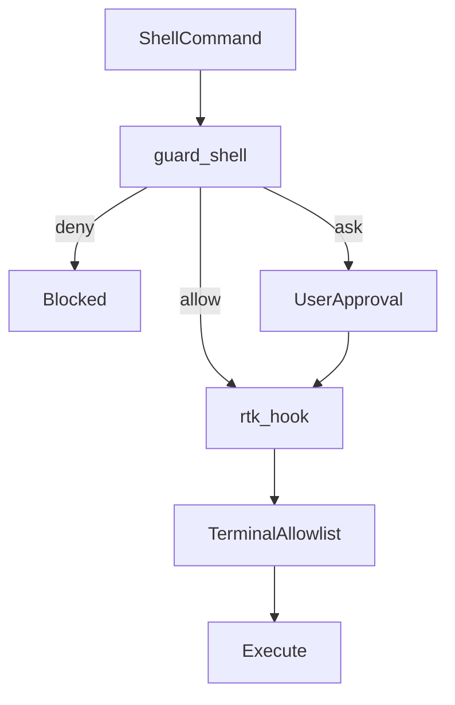

# `packages/shared/shared/ai/`（クロスツール共有素材）

Cursor / Claude Code / Gemini CLI が共通で参照する素材の原本。`make stow` で `~/.config/shared/ai/` に展開される（`packages/shared` パッケージが `~/.config` に stow される）。

- 命名・配置: [CONVENTIONS.md](./CONVENTIONS.md)
- ローカル上書き（`.local.md`）: 端末固有の手順は **`README.local.md`**（`*.local.*` で gitignore。各自作成・private バックアップ）

## ディレクトリ構成

```
packages/shared/
└── shared/
    └── ai/
        ├── AGENTS.md       # 3 ツール共通の規約ドキュメント
        ├── docs/           # クロスツールドキュメント（RTK 等）
        ├── agents/         # frontmatter なしの agent 本文
        ├── commands/       # frontmatter なしの command 本文
        ├── rules/          # frontmatter なしの rule 本文
        └── hooks/          # 共有シェルスクリプト（guard-shell 本体）
```

各ツールの `packages/<tool>/` 配下から、`@`-import（**`@~/.config/shared/ai/` 絶対パス**）で取り込む。

## `@`-import パス（`@~/.config/shared/ai/` 絶対パス）

`stow` で `~/.config/shared/ai/` にデプロイされた共有本文を、`@~/.config/shared/ai/...` で参照する。Cursor は symlink の配置場所からの相対パスでは共有本文に届かないため、この絶対パス形式を使う。

| ラッパー配置（リポジトリ）             | 共有本文への import 例                    |
| -------------------------------------- | ----------------------------------------- |
| `packages/cursor/commands/*.md`        | `@~/.config/shared/ai/commands/...`       |
| `packages/cursor/agents/*.md`          | `@~/.config/shared/ai/agents/...`         |
| `packages/cursor/rules/<subdir>/*.mdc` | `@~/.config/shared/ai/rules/<subdir>/...` |
| `packages/claude/commands/*.md`        | `@~/.config/shared/ai/commands/...`       |
| `packages/claude/agents/*.md`          | `@~/.config/shared/ai/agents/...`         |
| `packages/claude/rules/<subdir>/*.md`  | `@~/.config/shared/ai/rules/<subdir>/...` |
| `packages/claude/CLAUDE.md`            | `@~/.config/shared/ai/AGENTS.md`          |

**フック**: 判定ロジックの正本は [`shared/ai/hooks/guard-shell.sh`](hooks/guard-shell.sh) のみ（stdin の JSON を解釈し `permission` を返す）。`make stow` で `~/.config/shared/ai/hooks/` に展開される。Cursor は [`packages/cursor/hooks/guard-shell.sh`](../../cursor/hooks/guard-shell.sh) が `$HOME/.config/shared/ai/hooks/guard-shell.sh` へ `exec` する薄ラッパー。Claude は [`packages/claude/hooks/guard-shell.sh`](../../claude/hooks/guard-shell.sh)（adapter）が同じ JSON 形を `$HOME/.config/shared/ai/hooks/guard-shell.sh` にパイプする。RTK hook（`rtk hook claude` / `rtk hook cursor`）は guard の**後**に実行される。

## Shell セキュリティ: deny / ask / allow

3 層で Shell 実行を制御する。正本は guard-shell；allowlist と RTK は補助レイヤ。



| レイヤ        | 正本                                                                | 役割                                                                                              |
| ------------- | ------------------------------------------------------------------- | ------------------------------------------------------------------------------------------------- |
| **guard**     | [`hooks/guard-shell.sh`](hooks/guard-shell.sh)                      | git / gh / pnpm の deny・ask（包括的判定）。`rtk ` プレフィックスを strip して分類                |
| **RTK**       | `packages/claude/settings.json`, `packages/cursor/hooks.json`       | トークン削減のためコマンドを `rtk` 経由へ書き換え。Claude `permissions.deny` 対象は書き換えしない |
| **allowlist** | `packages/cursor/permissions.json`, `packages/claude/settings.json` | Auto-run 許可（読み取り専用 terminal / MCP）。RTK 書き換え後は hook が allow を返す               |

### Claude `permissions.deny` と guard の役割分担

| 対象 | Claude settings.deny                         | guard-shell                                                            |
| ---- | -------------------------------------------- | ---------------------------------------------------------------------- |
| 目的 | RTK が deny ルールを読み、書き換えをスキップ | 包括的 deny/ask（全 Bash / beforeShellExecution）                      |
| 範囲 | 破壊的 git/gh の最小セット（13 件）          | git/gh/pnpm の deny・ask・allow 全体                                   |
| 更新 | deny 追加時は guard と意図を揃える           | 判定変更時は [`guard-shell.test.sh`](hooks/guard-shell.test.sh) を更新 |

### guard 判定表（代表ケース）

| コマンド                                                                                                    | 判定  | 備考                              |
| ----------------------------------------------------------------------------------------------------------- | ----- | --------------------------------- |
| `git reset --hard`, `git clean -f`, `git branch -D`                                                         | deny  | 不可逆操作                        |
| `git commit`, `git push`, `git checkout`, `git fetch`, `git pull`, `git clone`, `git config`, `git restore` | deny  | ユーザー実行推奨                  |
| `git rebase`                                                                                                | ask   | ユーザー承認                      |
| `git status`, `git diff`, `git log`, `git show`, `git add`                                                  | allow | allowlist と併用                  |
| `rtk git push`                                                                                              | deny  | RTK プレフィックス strip 後に分類 |
| `rtk git status`                                                                                            | allow | 同上                              |
| `gh pr merge`, `gh repo delete`, `gh (release\|issue\|gist\|run) delete`, `gh repo archive`                 | deny  | 不可逆操作                        |
| `gh pr list`, `gh pr view`, `gh run list`, `gh api` (GET)                                                   | allow | allowlist と併用                  |
| `gh pr create`, `gh issue create`, `gh workflow run` 等                                                     | ask   | 書き込み操作                      |
| `pnpm exec vitest`, `pnpm exec oxlint`                                                                      | allow | プロジェクト linters              |
| `pnpm exec` (other), `pnpm dlx`                                                                             | ask   | 任意バイナリ                      |

全ケース: [`guard-shell.test.sh`](hooks/guard-shell.test.sh)。Cursor README の詳細表: [`packages/cursor/README.md`](../../cursor/README.md)。

Allowlist 同期: [AGENTS.md](./AGENTS.md) のチェックリスト。検証: `packages/shared/scripts/check-allowlist-sync.sh`, `check-deny-guard-sync.sh`。RTK 運用: [docs/RTK.md](./docs/RTK.md)。

## ローカル専用ファイル（`*.local.*`）

- **ツール専用**: `packages/cursor/` / `packages/claude/` の `*.local.*` も同様（`.gitignore` で除外）。運用メモは `README.local.md`。
- **共有本文**: 汎用 `.md`（Git）と同名の **`.local.md`（gitignore）** を同じディレクトリに置く。Git 側のルール・コマンドは「存在すれば Read」と記載し、無くても動作する。
- 参照パス: `@~/.config/shared/ai/...`（stow 後）

## 編集ルール

- ここに置くファイルは **frontmatter を含めない**（ツール非依存の本文のみ）
- ツール固有の挙動（globs / model / readonly / tools / hook 入出力 JSON など）は呼び出し側（各 `packages/<tool>/`）で表現する

## ルールファイルの所在（Cursor / Claude 共通）

共有の規約本文はすべてこのツリー内の `rules/**/*.md` にある。`make stow` により `~/.config/shared/ai/rules/` へ展開される。

**Read ツールで本文を開くとき**は、次のいずれかを使う（実在パスを指す）。

- この dotfiles リポジトリをワークスペースにしている場合: `packages/shared/shared/ai/rules/.../*.md`
- デプロイ済みの場合: `~/.config/shared/ai/rules/.../*.md`

Cursor の「ルール」として frontmatter（`description` / `globs` / `alwaysApply` 等）付きで読み込まれるファイルは **`~/.cursor/rules/**/<name>.mdc`** にあり、本文は `@~/.config/shared/ai/rules/.../<name>.md` と同一である。

Claude Code の `~/.claude/rules/**/*.md` はラッパーであり、中身は同じく `@~/.config/shared/ai/rules/.../*.md` を `@`-import する。

### 新規ルールやチェックリストを追加するとき

1. 本文（frontmatter なし）を `packages/shared/shared/ai/rules/<subdir>/` に `.md` で追加する。
2. Cursor 向けに `packages/cursor/rules/<subdir>/<名前>.mdc` を置き、frontmatter のあとに `@~/.config/shared/ai/rules/<subdir>/<名前>.md` で本文を取り込む（既存の `.mdc` をコピーしてパスだけ差し替えるとよい）。
3. Claude 向けに `packages/claude/rules/<subdir>/<名前>.md` を置き、先頭行で `@~/.config/shared/ai/rules/<subdir>/<名前>.md` とする。
4. コマンドやエージェントの説明文では、`packages/shared/shared/ai/rules/...` とデプロイ後の `~/.config/shared/ai/` を併記する。
